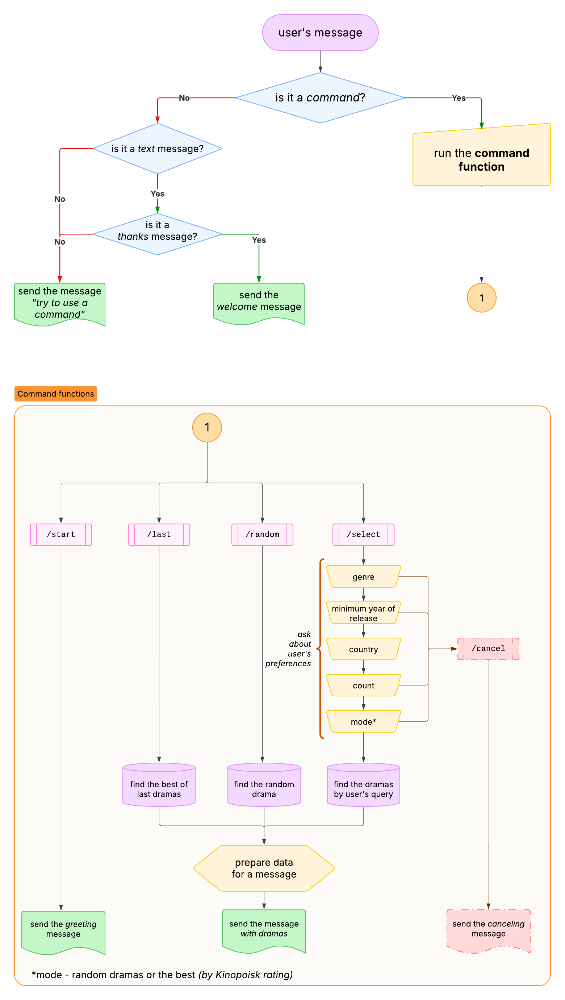
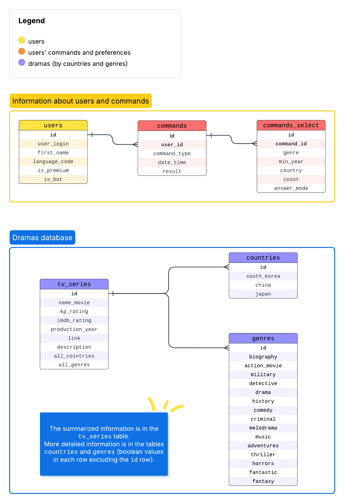

# DoramaBot

## Content

- Documentation:
  - [Kinopoisk API](#Information about the Kinopoisk API)
  - [Python library for telegram bot](#Information about the general library)
- Project structure:
  - [Bot](#Bot actions structure)
  - [Database](#Database structure)

---

## Information about the Kinopoisk API

*Documentation is on the [link](https://kinopoiskdev.readme.io/reference/фильмы-сериалы-и-тд).*

## Information about the general library

*Documentation for `python-telegram-bot` library [here](https://docs.python-telegram-bot.org/en/stable/index.html).*

This library can work both **synchronously** and **asynchronously**, depending on how you use it.

 - <u>synchronous mode:</u> in the old versions (before 20) of `python-telegram-bot`. 
This means that the bot will handle **one update at a time** and block while processing each update. 
If bot is doing something slow, like making a network request or querying a database, 
it will block the event loop until that operation completes.

 - <u>asynchronous mode:</u> starting with version 20 and beyond, `python-telegram-bot` introduced full `async` support. 
While using the library asynchronously, it **can handle multiple updates concurrently**, without blocking on operations 
that can be done asynchronously (e.g., I/O tasks, network requests). This allows for better performance, 
especially when handling many updates or performing long-running tasks.

### Restrictions for the bot messages:

 - according to the [Telegram Bot API documentation](https://core.telegram.org/bots/api#updating-messages), 
the maximum length of a message is **4096 characters**. If the message exceeds this limit, the server will return 
a `400 bad request` error.

 - while sending messages **the telegram parse mode isn't supported**, but _markdown_ or _html_ parse modes can be used.

 - different types of messages can be processed by: 
   - different Handlers (`CommandHandler` for command messages like `/start` and `MessageHandler` for other messages),
   - filters in `Handler` (`filters.TEXT`, `filters.AUDIO` etc.).

---

## Bot actions structure

## Database structure

