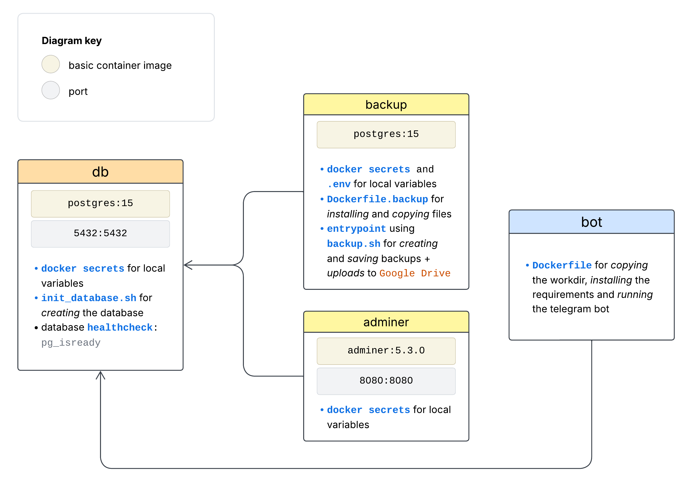
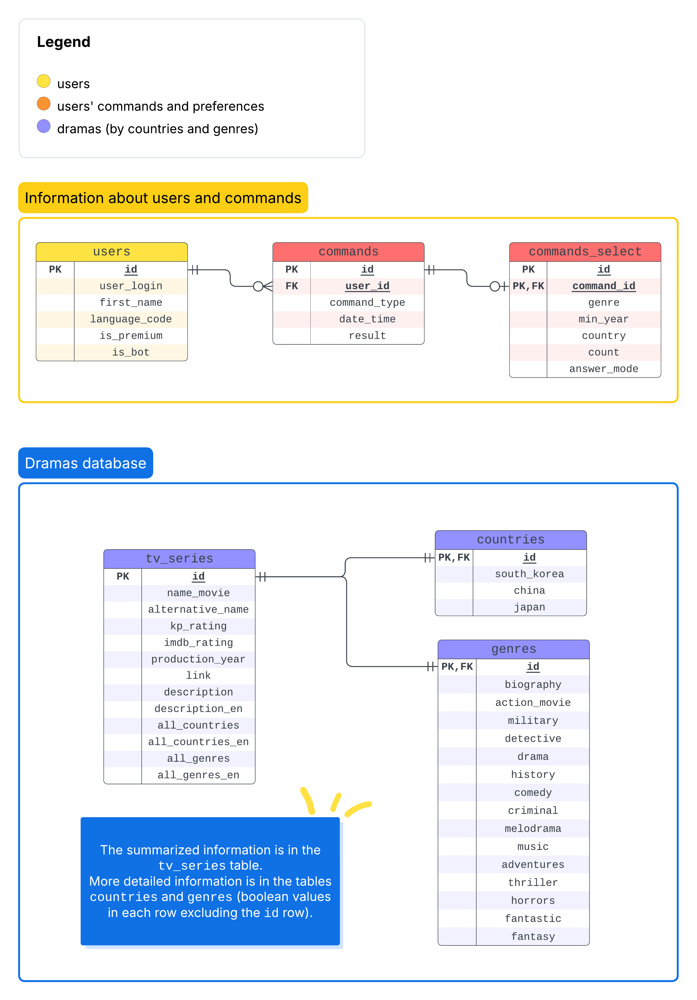

# DoramaBot

## Content

- Documentation:
  - [Kinopoisk API](#api)
  - [Python library for telegram bot](#library)
  - [Creating the database](#series)
- Project structure:
  - [Multi-container deployment](#container) using Docker
  - [Database](#database)
  - [Bot](#bot)

---

<!-- headings -->

## Information about the Kinopoisk API

*Documentation is on the [link](https://kinopoiskdev.readme.io/reference/фильмы-сериалы-и-тд).*

## Information about the library for the telegram bot

*Documentation for `python-telegram-bot` library is [here](https://docs.python-telegram-bot.org/en/stable/index.html).*

This library can work both **synchronously** and **asynchronously**, depending on how you use it.

 - <u>synchronous mode:</u> in the old versions (before 20) of `python-telegram-bot`. 
This means that the bot will handle **one update at a time** and block while processing each update. 
If bot is doing something slow, like making a network request or querying a database, 
it will block the event loop until that operation completes.

 - <u>asynchronous mode:</u> starting with version 20 and beyond, `python-telegram-bot` introduced full `async` support. 
While using the library asynchronously, it **can handle multiple updates concurrently**, without blocking on operations 
that can be done asynchronously (e.g., I/O tasks, network requests). This allows for better performance, 
especially when handling many updates or performing long-running tasks.

### Restrictions for the bot messages:

 - according to the [Telegram Bot API documentation](https://core.telegram.org/bots/api#updating-messages), 
the maximum length of a message is **4096 characters**. If the message exceeds this limit, the server will return 
a `400 bad request` error.

 - while sending messages **the telegram parse mode isn't supported**, but _markdown_ or _html_ parse modes can be used.

 - different types of messages can be processed by: 
   - different Handlers (`CommandHandler` for command messages like `/start` and `MessageHandler` for other messages),
   - filters in `Handler` (`filters.TEXT`, `filters.AUDIO` etc.).

## Creating the tv-series database

The algorithm for uploading new series to my local database is as follows:

1. Upload all `id` of already existed series in the database.
2. Send the `get` query to the Kinopoist API to find the dramas from South Korea, Japan and China, 
and create the dataframe with received series.
3. Filter the dataframe by deleting already saved series.
4. Translate the russian series context to the English language for users with English `language_code` (in the Telegram) 
using the [googletrans](https://pypi.org/project/googletrans/) library for python with [Google Translate API](https://cloud.google.com/translate/docs/reference/rest). 
5. Update the database using `PostgreSQL`.

---

## Docker multi-container deployment

The structure of the `docker-compose.yml` file is presented below:

## Database structure

## Bot actions structure

